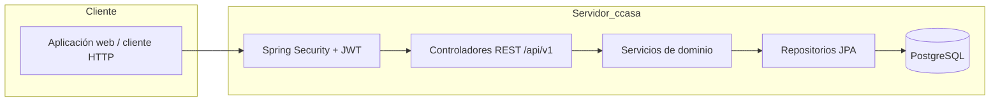
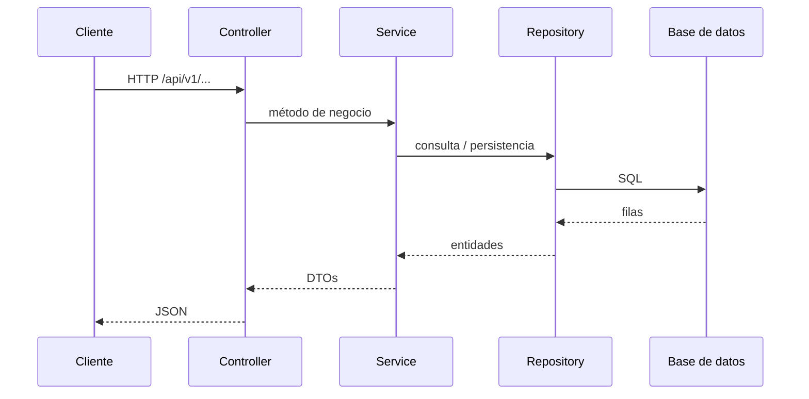
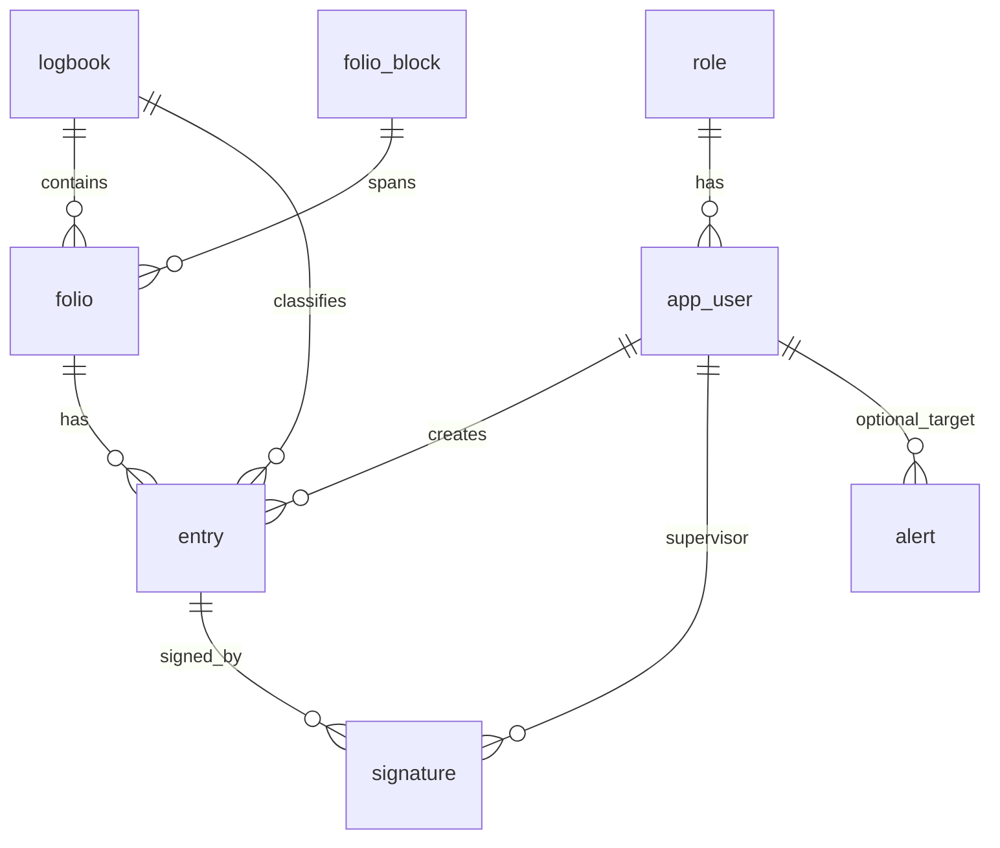
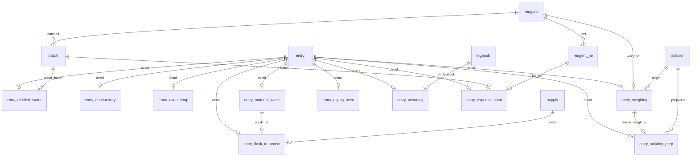

# ccasa — Arquitectura y modelo de datos

**Sistema de gestión digital de bitácoras de laboratorio**

Documento orientado a **cliente y stakeholders técnicos**: resume el propósito del producto, la arquitectura del backend actual, el flujo de datos típico y el **modelo relacional** derivado del código fuente (entidades JPA). La **traducción fiel a PostgreSQL** está en el script SQL enlazado al final.

---

## 1. Propósito y audiencia

**ccasa** digitaliza el registro, la trazabilidad y el control de bitácoras de laboratorio (folios, entradas por tipo de ensayo, firmas, alertas e inventario de reactivos), sustituyendo o complementando hojas Excel y procesos manuales.

Este documento sirve para:

- **Negocio:** entender qué hace el sistema y qué información persiste.
- **TI / integración:** conocer capas, API versionada y forma del esquema de base de datos.

---

## 2. Resumen ejecutivo

| Aspecto | Descripción |
|--------|-------------|
| **Objetivo** | Gestionar bitácoras, folios y entradas tipadas con auditoría y borrado lógico. |
| **Stack** | Java 21, Spring Boot, Spring Security, JPA/Hibernate, PostgreSQL (H2 en desarrollo). |
| **API** | REST versionada bajo **`/api/v1/`**; los controladores exponen DTOs, no entidades. |
| **Seguridad** | Autenticación basada en JWT (p. ej. claves RSA); CORS y límites de tasa en rutas de autenticación según configuración del proyecto. |
| **Datos y tiempo** | Timestamps en **`TIMESTAMPTZ`** / UTC en base de datos y serialización JSON alineada con la configuración Spring (UTC). |
| **Tenancy** | El código actual modela un **laboratorio único** (single-tenant). Una evolución futura hacia multi-tenant (por ejemplo `tenant_id` en entidades) puede plantearse en roadmap de producto; **no está presente en el MER actual del código**. |

---

## 3. Arquitectura de software (alto nivel)

El cliente (navegador u otra aplicación) consume la API HTTP; el servidor aplica seguridad, reglas de negocio y persistencia.

Si el proyecto expone endpoints de supervisión o control (p. ej. bajo un prefijo tipo `/api/control/v1/`), actúan en el mismo plano de aplicación con reglas de acceso distintas; el diagrama anterior sigue siendo válido como vista general.

---

## 4. Arquitectura en detalle (backend)

Paquete raíz: `com.backend.ccasa`.

| Capa | Paquete / rol |
|------|----------------|
| **REST** | `controllers` — solo orquestación HTTP; sin lógica de negocio. |
| **Contrato** | `services` — interfaces `I…Service`. |
| **Negocio** | `services.impl` — implementaciones con reglas y transacciones. |
| **Persistencia** | `persistence.entities`, `persistence.entities.audit`, `persistence.entities.entry`, `persistence.repositories`. |
| **Contratos API** | `services.models.dtos`, `services.models.enums`. |
| **Seguridad** | `security` — configuración Spring Security, filtros, etc. |
| **Errores** | `exceptions` + manejador global de respuestas coherentes (incl. 403). |
| **Arranque / datos** | `config` — cargadores, beans de aplicación. |

**Convenciones relevantes para el cliente técnico:**

- Sin Lombok: constructores, getters y setters explícitos.
- Inyección por **constructor**.
- **Borrado lógico:** columna `deleted_at`; las consultas de negocio filtran filas activas (`deleted_at IS NULL`).
- **Auditoría:** clase base `Auditable` con `created_at`, `updated_at`, `deleted_at` y referencias opcionales a `app_user` para quién creó, actualizó o borró.

---

## 5. Flujo de datos típico: consulta de bitácoras o registro de agua destilada

1. El **cliente** invoca `GET` o `POST` bajo `/api/v1/…` con JWT válido.
2. El **controlador** valida la petición y delega en un **servicio** (`…ServiceImpl`).
3. El servicio aplica reglas (roles, estado de folio/entrada, invariantes de dominio).
4. El **repositorio** ejecuta consultas JPA sobre **entidades**.
5. La respuesta al cliente son **DTOs**, no tablas ni entidades expuestas directamente.

*Ejemplo de dominio:* una entrada de **agua destilada** enlaza la fila genérica `entry` con la tabla de detalle `entry_distilled_water` (lecturas pH/CE, promedios, aceptación, lote de agua opcional).

---

## 6. Modelo de datos (persistencia)

### 6.1 Patrón `Auditable` y soft delete

Todas las entidades de negocio concretas extienden `Auditable`:

- **`created_at`** — obligatorio al insertar.
- **`updated_at`**, **`deleted_at`** — opcionales; `deleted_at` marca borrado lógico.
- **`created_by_user_id`**, **`updated_by_user_id`**, **`deleted_by_user_id`** — FK opcionales hacia **`app_user`**, para trazabilidad de usuario.

### 6.2 Tablas (resumen)

| Tabla | Propósito breve |
|-------|------------------|
| `role` | Roles (Admin, Analyst, Sampler, Supervisor, etc.). |
| `app_user` | Usuarios del laboratorio, credenciales y rol. |
| `logbook` | Bitácora (código único, nombre, límites). |
| `folio_block` | Bloque de numeración de folios. |
| `folio` | Folio dentro de bitácora y bloque; estado (abierto/cerrado). |
| `entry` | Entrada genérica; estado (borrador/firmado/bloqueado); autor y timestamps. |
| `signature` | Firma de supervisor sobre una entrada. |
| `alert` | Alertas del sistema (tipo, mensaje, usuario destino, estado). |
| `reagent`, `reagent_jar`, `batch` | Reactivos, frascos y lotes. |
| `solution`, `supply` | Soluciones y suministros. |
| `entry_distilled_water` | Detalle agua destilada (pH/CE, lote agua). |
| `entry_conductivity` | Conductividad. |
| `entry_oven_temp` | Temperatura de horno. |
| `entry_weighing` | Pesadas (reactivo, solución destino). |
| `entry_solution_prep` | Preparación de solución (enlaza pesada y analista opcional). |
| `entry_material_wash` | Lavado de material. |
| `entry_drying_oven` | Secado en horno. |
| `entry_accuracy` | Precisión / referencia cruzada con bitácora pH. |
| `entry_flask_treatment` | Tratamiento de matraz (enlaza lavado, suministro hisopo). |
| `entry_expense_chart` | Carta de gastos (lote, frasco KCl, agua). |

### 6.3 Diagrama ER — núcleo (identidad, bitácora, folio, entrada)

### 6.4 Diagrama ER — extensiones `entry_*` y catálogos relacionados

*Nota:* en el modelo JPA, cada subtipo de entrada referencia **`entry_id`**; la cardinalidad efectiva en negocio (1:1 vs 1:N por tipo) la define la aplicación al crear filas.

---

## 7. Seguridad y despliegue (breve)

- **Autenticación:** JWT (habitualmente firmado con RSA); el cliente envía el token en las peticiones a la API.
- **Autorización:** roles de aplicación alineados con `role` / `app_user`.
- **CORS y rate limiting:** según `application.yml` o clases de configuración del módulo `security`.
- **Base de datos:** PostgreSQL en producción; usar **UTC** en sesión y en la aplicación para coherencia con auditoría e informes.

---

## 8. Esquema SQL PostgreSQL

El archivo **[sql/ccasa_schema_postgresql.sql](sql/ccasa_schema_postgresql.sql)** contiene:

- `CREATE TABLE` en **orden compatible con FKs** (incluye resolución del ciclo `role` ↔ `app_user` mediante `ALTER` de auditoría).
- Tipos alineados con JPA: `TIMESTAMPTZ`, `DATE`, `TIME`, `NUMERIC(p,s)`, `VARCHAR`, `TEXT`, `BOOLEAN`, enums como `VARCHAR`.
- Restricciones **`UNIQUE`** donde existen en entidades (`role.name`, `app_user.email`, `logbook.code`).
- **Índices** en FKs y combinaciones útiles para consultas con `deleted_at`.
- **`COMMENT ON`** en tablas y columnas clave.

**Uso:** script pensado para **inicialización en base vacía** (sin `IF NOT EXISTS` en esta versión). Para entornos existentes, conviene comparar con migraciones Flyway/Liquibase cuando se incorporen al proyecto.

---

## 9. Orden sugerido de ejecución del script

1. Crear base de datos y usuario con permisos DDL adecuados.
2. Opcional: `SET TIME ZONE 'UTC';` en la sesión antes de cargar datos de prueba.
3. Ejecutar el archivo `ccasa_schema_postgresql.sql` completo (incluye `BEGIN`/`COMMIT`).

---

*Documento generado a partir del código en `ccasaBackend/src/main/java/com/backend/ccasa/persistence`. Cualquier cambio en entidades JPA debe reflejarse actualizando este Markdown y el script SQL.*
